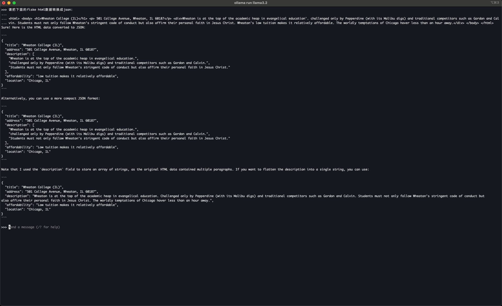

1. `fiske_new_york_university.1.image_stripped.html`是去除base64图片和自体后的html, 73KB. 
    1. 尝试直接把这段html扔给doubao, 让它提取大学名称，失败， 说输入超过字数限制了。
    1. 总共包含3页(`
`标签的html, 把`<h1>`里面的内容提取为大学名.
1. 数据集用simple_html.json, 167条重复的记录。
1. Base model用`Llama-3.2-1B-Instruct`.
1. Loss很快下降为0.
1. 结果, 输出多条重复的json，停不下来的样子，还会有截断。

**步骤**：
1. `python Fiske/train_exp1.py`
1. `streamlit run chat.py`
1. 隧道连接到远程: `ssh -L 8501:localhost:8501 zhiyong@35.84.190.171`
1. 打开本地页面: `http://localhost:8501`

**截图:**
   
   

# 实验2
和实验1一样，只是数据集换了一下，换成了`simple_html2.json`, 这个数据集在`simple_html1.json`的基础上，把`address`里面的邮编换成了递增的数字, 给数据集加了一点点变化。训练的效果和实验1基本一样，另外，感觉AI变啰嗦了，说很多不需要的东西。

**概述**：
1. 把html里面的大学名称和地址提取出来，以json格式输出.
1. 数据集用`simple_html2.json`, 10000条记录, 包含大学名称和地址，名称都一样，地址也都一样，只是末尾的zip code用了递增数字。
1. Base model用`Llama-3.2-1B-Instruct`.
1. 17分钟微调完毕。
1. Loss很快下降为0.
1. 结果, 输出多条重复的json，停不下来的样子，还会有截断。
1. 它在输出的内容里面有提到正确答案。
1. 还出现很多幻觉，有一次对话里面还提到新加坡，不知道是什么内容关联到了新加坡

**截图:**
   
   

# 实验3

代码不变, base model换成了`Llama-3.2-3B-Instruct`, 数据集换了一下，换成了`simple_html3.json`, 这个数据集是从Fiske数据里面抽了30条记录，把university name, address, short_intro打乱，拼凑了27000条记录.

**概述**：
1. 把html里面的大学名称, 简介和地址提取出来，以json格式输出.
1. 数据集用`simple_html3.json`, 27000条记录, 30条Fiske University记录，里面的name, address, short_intro组合而来。
1. Base model用`Llama-3.2-3B-Instruct`.
1. 微调速度明显下降, 要5个半小时。
1. Loss很快下降为0.
1. 结果, 输出想要的json了。
1. __问题1:__ 结果末尾出现了`<|eom_id|>`, 原因未知，解决办法未知.
    1. 这次的数据集里面有一个问题， short_intro的
标签和
配对了。后面把
换成
再试一下看看.
    1. 这个标记也不是每次都出现，换Wheaton College (IL)的prompt的时候就不出现这种标记了。
    1. 实验对比下来发现，这个标记只在会话的第一次回复里面出现，可以看后面的对比截图。
1. __问题2:__ 单引号没有被正确处理。short_intro被切割成好几段，出现多个'short_intro'. 
    1. 出现short_intro重复的原因是原句里面有"education',", 这个"',"正好是json字符串数组的分割标志，导致AI认为当前字符串已经结束了，要进入下一个 key/value pair了，于是新起了一个'short_intro', 典型的幻觉(hallucination).
    1. 把"education',"换成"education'."之后输出里面就没有重复'short_intro'的现象了，但是，也没有正确给单引号做转义.
    1. 豆包能处理json字符串单引号双引号转义的问题. Llama 3.2 3B也可以, 3.2 3B用的json字符串用的是双引号，微调处理的是用单引号。
        ~~~
        把下面的html按div转换成json数组：

        
Wheaton is "at the top of the academic heap in evangelical education', challenged only by Pepperdine (with its Malibu digs) and traditional competitors such as Gordon and Calvin. Students must not only follow Wheaton’s stringent code of conduct but also affirm their personal faith in Jesus Christ. Wheaton’s low tuition makes it relatively affordable. The worldly temptations of Chicago hover less than an hour away.

        
Wheaton is at the top of the academic heap in evangelical education', challenged only by Pepperdine (with its Malibu digs) and traditional competitors such as Gordon and Calvin. Students must not only follow Wheaton’s stringent code of conduct but also affirm their personal faith in Jesus Christ. Wheaton’s low tuition makes it relatively affordable. The worldly temptations of Chicago" hover less than an hour away.

        ~~~
    1. dict里的字符串to_str的时候默认是单引号引起来的。
    1. 关于json格式的问题，有几篇文章可以看看：
        1. https://community.openai.com/t/how-do-i-ensure-that-json-mode-properly-escapes-quotation-marks/619138/4, 关于json双引号escape的问题讨论.
        1. https://developer.aliyun.com/article/1632397, 探索LLM推理全阶段的JSON格式输出限制方法
        1. https://openai.com/index/introducing-structured-outputs-in-the-api/, Introducing Structured Outputs in the API
        1. https://blog.csdn.net/Python_cocola/article/details/142620789, 如何正确约束输出格式，Deepmind最新：让LLM精准生成任何格式的文本，COLM2024.
            1. 这里提到一个很重要的点： 分词，LLM的阿喀琉斯之踵
        1. https://developer.volcengine.com/articles/7402451664554491945, 最新研究：大语言模型使用Json格式输出会降低模型性能吗？ 
            1. 这里面有提到一个很有意思的现象: GPT-3.5-turbo 在这个 GSM8K数学问题上用标准自然语言输出时，可以给出正确答案，但是一旦添加了格式限制，GPT-3.5-turbo就输出了错误答案。
        1. 
    1. a
1. __问题3:__ 大学名字变形了, `Wheaton College (IL)` 提取成`Wheaton College`
1. 测试prompt:
   ~~~html
    请把下面的fiske html转换成json格式:

    <html> <body> <h1>Yale University</h1> 
 38 Hillhouse Avenue, New Haven, CT 06520
 
Yale is the middle- sized member of the Ivy League’s big three: bigger than Princeton, smaller than Harvard. Its widely imitated residential college system helps Yale strike a balance between being a research university and an undergraduate college. New Haven isn’t New York, but it has a relatively lively urban scene. Plan to work hard.
 </body> </html>
   ~~~

  含单引号, short_intro第一句， education后面加了一个单引号。
   ~~~html
    请把下面的fiske html数据转换成json:

    <html> <body> <h1>Wheaton College (IL)</h1> 
 501 College Avenue, Wheaton, IL 60187
 
    
Wheaton is at the top of the academic heap in evangelical education', challenged only by Pepperdine (with its Malibu digs) and traditional competitors such as Gordon and Calvin. Students must not only follow Wheaton’s stringent code of conduct but also affirm their personal faith in Jesus Christ. Wheaton’s low tuition makes it relatively affordable. The worldly temptations of Chicago hover less than an hour away.
 </body> </html>
   ~~~

# 实验4 
**截图**：

   
   
   
   

# 问题
1. 用llama3.2 1b + simple_html.json 训练, 不停重复同一条json记录.
1. 

# Refs
1. https://www.datacamp.com/tutorial/llama3-fine-tuning-locally 
1. https://blog.csdn.net/zwqjoy/article/details/132772751, 讲指令格式。
1. https://community.openai.com/t/how-do-i-ensure-that-json-mode-properly-escapes-quotation-marks/619138/4, 关于json双引号escape的问题讨论.
1. https://developer.aliyun.com/article/1632397, 探索LLM推理全阶段的JSON格式输出限制方法
1. https://qiankunli.github.io/2024/07/28/llm_finetune_practice.html, 大模型微调实践, 对instruction数据结构讲解非常清楚.
1. https://qiankunli.github.io/2024/07/28/llm_finetune_practice.html, LLM微调实践， 有很多经验分享.
1. https://medium.com/@symflower/using-llms-to-transpile-code-from-go-java-to-ruby-dbba6046298d , Using LLMs to transpile code (from Go & Java to Ruby)
1. https://arxiv.org/html/2406.03003v1 , Verified Code Transpilation with LLMs
1. https://github.com/NeuralCoder3/transpilation, A summary of ideas about transpilation -- work in progress
1. https://huggingface.co/blog/codeparrot , Training CodeParrot 🦜 from Scratch
1. https://microsoft.github.io/CodeXGLUE/ ， CodeXGLUE stands for General Language Understanding Evaluation benchmark for CODE. It includes 14 datasets for 10 diversified programming language tasks covering code-code (clone detection, defect detection, cloze test, code completion, code refinement, and code-to-code translation), text-code (natural language code search, text-to-code generation), code-text (code summarization) and text-text (documentation translation) scenarios.
1. https://www.youtube.com/watch?v=eaTIrJnkuNI , Understanding LLMs for Code Generation
1. https://www.youtube.com/watch?v=eC6Hd1hFvos , Fine-tuning Large Language Models (LLMs) | w/ Example Code
1. https://jina.ai/news/readerlm-v2-frontier-small-language-model-for-html-to-markdown-and-json/, ReaderLM v2: Frontier Small Language Model for HTML to Markdown and JSON
1. 